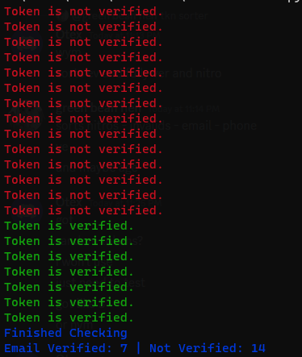

# Discord Token Checker

  

- Python 3.x
- `requests` module (can be installed using `pip install requests`

## Notes

- Tokens that are invalid (i.e., not recognized by the Discord API) will be skipped and removed from the `tokens.txt` file.

  

